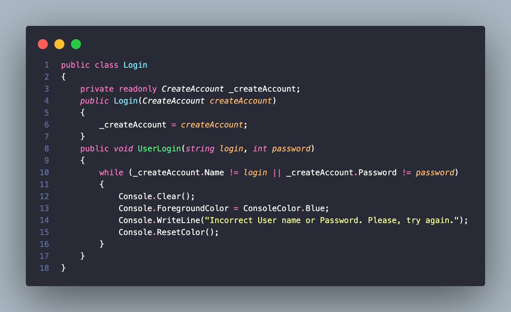
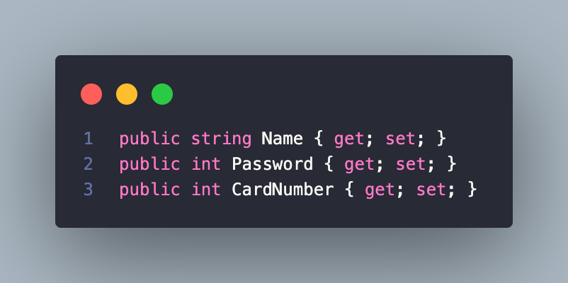
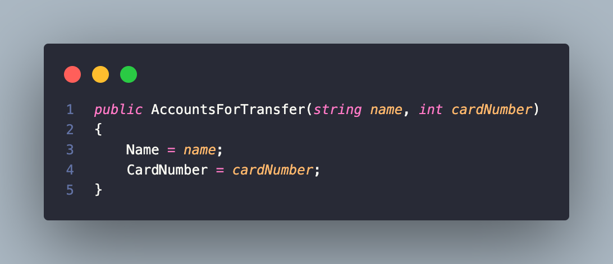
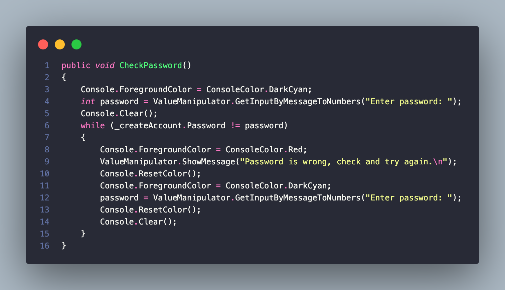
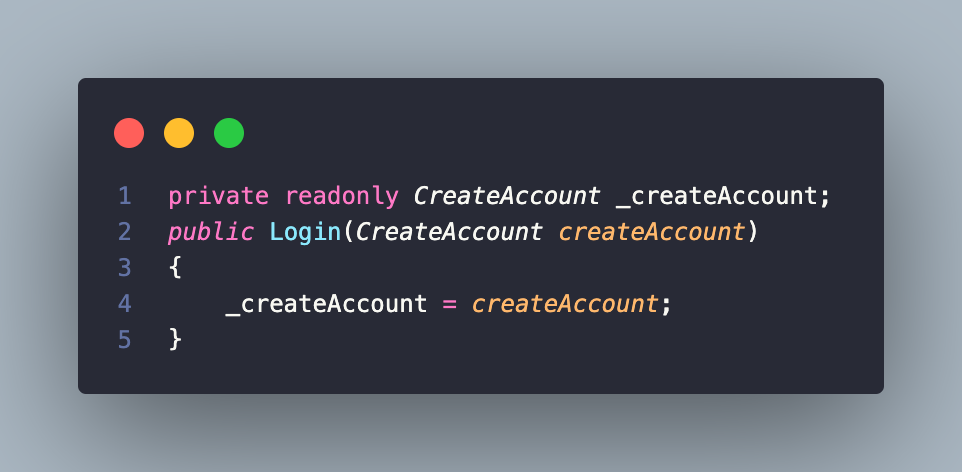
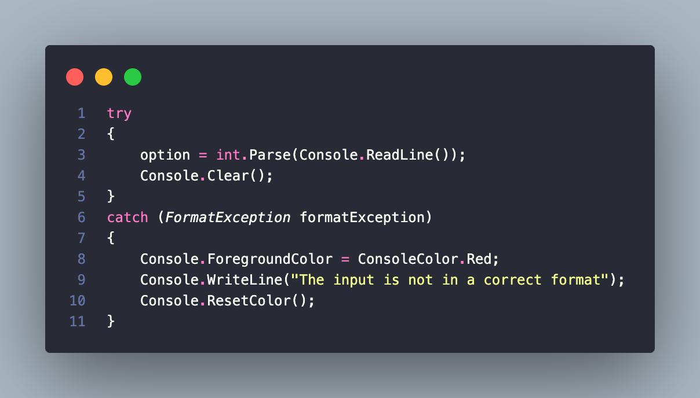

# BankSystemApp

### About the project
We present you a ready-made console project that has the ability to perform all the functions associated with money transfers, transfers to an account, crediting an account, withdrawing from an account, and so on.In general everything is like in reality, we tried to complicate the project and made it as convenient as possible for use and reading. I think this is a project for many novice programmers - a good example, and also a ready - made idea.

### What did we use to crate the project?
Of course, first of all, we took advantage of the **principles of OOP**(object oriented programming) in order to make the code more structured, modular, reusable and easily maintainable.

We also used **properties** to get and set the value hidden while the implementation or verification code.

**Constructors**, ask why? First of all, to initialize fields, properties and other members of object, as we as to perform any actions necessary to prepare the object for work. Constructors can also take parameters that allow you to set an initial value for an object when it is created.

**Methods** are a way to organize code so that it is more readable, reusable, and modular. Methods allow you to break a complex task into smaller and more logical parts that can be called from different places in the program. Methods cal also take parameters and return values, which makes them flexible and functional. Which we did accordingly.

**Dependency injection** was used via the class constructor to make the class more loosely coupled to specific implementations, depending on the situation, In our situation, this is the link between logging in and creating an account.

In the code you you can also see **try-catch** statements are used to handle exceptions, in our case it was not possible without **thy-catch**. An exception is a situation where an error or logical violation occurs.

We hope you understood everything, please copy the code and test it, maybe you will find something new for yourself.

[Instruction](https://www.loom.com/share/9cebefe04b8b40f0bb6c48f87f58ad59?sid=e90b647e-a46f-46e2-bca3-9f89aa2512f5) for copying the code.

If you have any questions or find an error in the code, please contact us.

**Contact developers**

[JohnnySenior](https://github.com/JohnnySenior) | [ZafarUrakov](https://github.com/ZafarUrakov)
